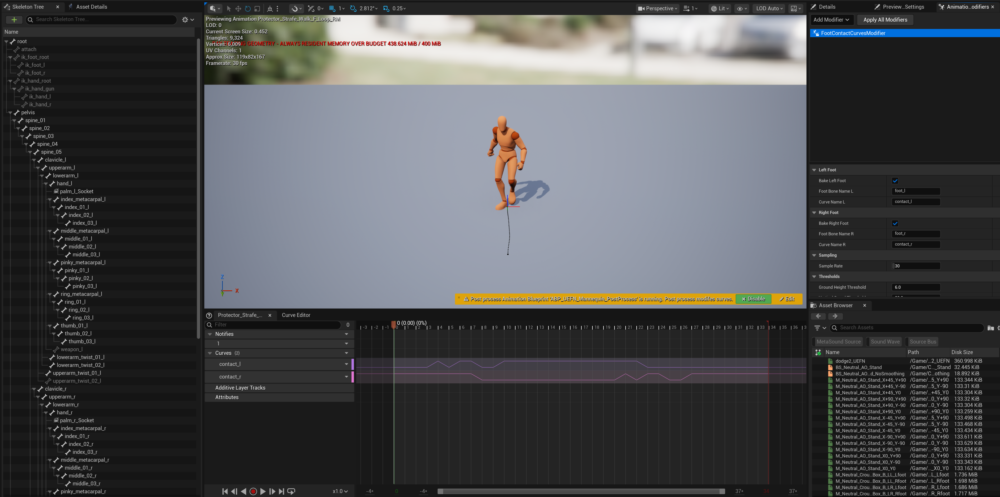

# Foot Contact Curves

An Unreal Engine **Animation Modifier** that bakes per-foot `contact_l` / `contact_r` curves onto your AnimSequences from foot bone height and speed thresholds. Drop-in compatible with **Game Animation Sample Project (GASP)**, motion-matching pipelines, and any system that expects 0/1 foot-contact gates for foot-lock IK, stride warping, or pose-search features.



---

## Why this exists

Epic's GASP locomotion clips ship with `contact_l` and `contact_r` curves baked in — but **the tool that generates them was never released**. Epic confirmed on a livestream that the curves were authored by an internal unreleased script.

If you bring custom locomotion animations into a GASP-based project (or any motion-matching setup that consumes contact curves), you're stuck either hand-keying every clip or writing the tool yourself.

This plugin closes that gap. Drop new clips into your project, multi-select them in the Content Browser, right-click → Apply, and every clip gets GASP-shaped contact curves.

---

## Installation

1. Copy the entire `FootContactCurves` folder into your project's `Plugins/` directory so you end up with:
   ```
   YourProject/Plugins/FootContactCurves/FootContactCurves.uplugin
   ```
2. Right-click your `.uproject` → **Generate Visual Studio project files**.
3. Build your editor target (in Visual Studio, or via your usual UBT command).
4. Open the project. The plugin auto-enables.

No engine source modifications. No extra plugin dependencies. Editor-only — nothing ships in your packaged builds.

---

## Usage

1. In the Content Browser, **multi-select** the AnimSequences you want to bake.
2. Right-click → **Animation Asset Actions → Apply Animation Modifier**.
3. Pick **Foot Contact Curves**.
4. Adjust settings if you need to (defaults work for the UE5 mannequin), click **Apply**.

Open any of the baked sequences and check the **Curves** panel — `contact_l` and `contact_r` will be there.

---

## Settings

| Property | Default | Notes |
|---|---|---|
| **Bake Left Foot** | `true` | Skip the left foot when off. |
| **Foot Bone Name L** | `foot_l` | Change for non-mannequin rigs (e.g. `LeftFoot`, `Bip01_L_Foot`). |
| **Curve Name L** | `contact_l` | Standard for GASP / Motion Matching. |
| **Bake Right Foot** | `true` | Skip the right foot when off. |
| **Foot Bone Name R** | `foot_r` | Same notes as left. |
| **Curve Name R** | `contact_r` | |
| **Sample Rate** | `30` | Sampling FPS (range 10–240). Higher = more accurate, slower bake. |
| **Ground Height Threshold** | `6.0` | Centimeters. A foot is "planted" when its height above that foot's lowest Z over the clip is below this. |
| **Vertical Speed Threshold** | `30.0` | cm/sec. A foot must be moving slower than this vertically to count as planted. |
| **Interpolation Mode** | `Linear` | `Linear` for smooth ramps, `Constant` for sharp 0/1 plateaus, `Cubic` for eased transitions. Pick to match your downstream consumer. |
| **Minimum Contact Frames** | `4` | Removes contact runs this short or shorter. At 30 fps this removes brief 1–4 frame false positives. |
| **Exclusive Foot Contacts** | `true` | Resolves transient walking overlap; sustained overlap that reaches the final sample is preserved for a terminal double-support pose. |
| **Overwrite Existing Curves** | `true` | Removes the existing curve with the configured name before baking. |

---

## How it works

Per clip:

1. **Pass 1 — find the ground.** Sample both enabled foot bones every frame in component (world) space; each foot keeps its own lowest Z over the clip as its ground baseline. This accounts for different left/right rest offsets.
2. **Pass 2 — classify each frame.** Mark each foot as planted (`1`) when both:
   - foot height above its ground baseline < `GroundHeightThreshold`, **AND**
   - foot vertical speed (`|ΔZ|` between consecutive frames) < `VerticalSpeedThreshold`
   - Otherwise mark it as in-air (`0`).
3. **Clean the contact gates.** Remove short contact islands up to `Minimum Contact Frames`, then resolve transient left/right overlap by keeping the foot with the stronger height/speed contact score. A sustained overlap that reaches the final sample is preserved so stop animations can end with both feet planted.
4. **Write the curves** through `IAnimationDataController::SetCurveKeys` with the chosen interpolation mode. Transactional, so they show up in the editor's undo stack.

Each bake logs to `LogFootContactCurves` (Output Log) with sample count, planted percentage, detected ground level, and the active thresholds — useful for tuning.

---

## Tuning

If the baked curve doesn't look right, check the **Output Log** for the bake stats and try:

| Symptom | Likely cause | Fix |
|---|---|---|
| Curve is flat 0 (nothing registers as planted) | `GroundHeightThreshold` too low, or wrong foot bone name | Bump threshold to 8–10 cm; verify bone name |
| Curve is flat 1 (everything is "planted") | Threshold too high, or `VerticalSpeedThreshold` too lenient | Lower `GroundHeightThreshold` to 4–5 cm; tighten speed |
| Curve flickers between 0 and 1 mid-step | Sampling aliasing on subtle motion noise | Raise **Sample Rate** to 60; widen thresholds slightly |
| Curve plateaus too soft / too sharp | Interpolation mode mismatch | Switch between `Linear` / `Constant` / `Cubic` |

---

## Reverting

Modifiers are reversible. With the AnimSequence open, find the **Animation Modifiers** panel in the asset Details; press **Revert** on the Foot Contact Curves entry to delete the curves it added. Or just re-apply with `Overwrite Existing Curves = true` to overwrite.

---

## Compatibility

- Tested on **Unreal Engine 5.8.1**. This plugin version targets the UE5.8 release line.
- Requires only the engine modules `AnimationModifiers` and `AnimationBlueprintLibrary` — both ship with the editor.
- Plugin module is `Type: Editor`, so it never compiles into shipping/cooked builds. Zero runtime cost.

---

## License

Released under the [MIT License](LICENSE). Copyright (c) 2026 Shane Beal.
