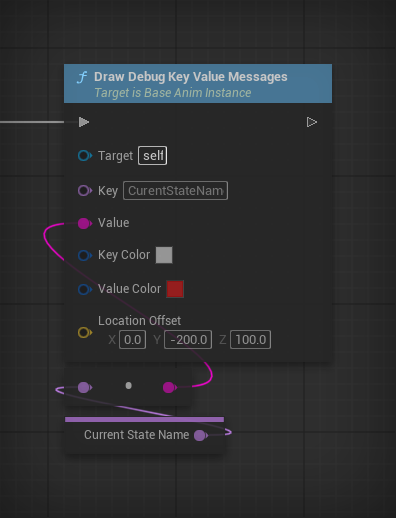
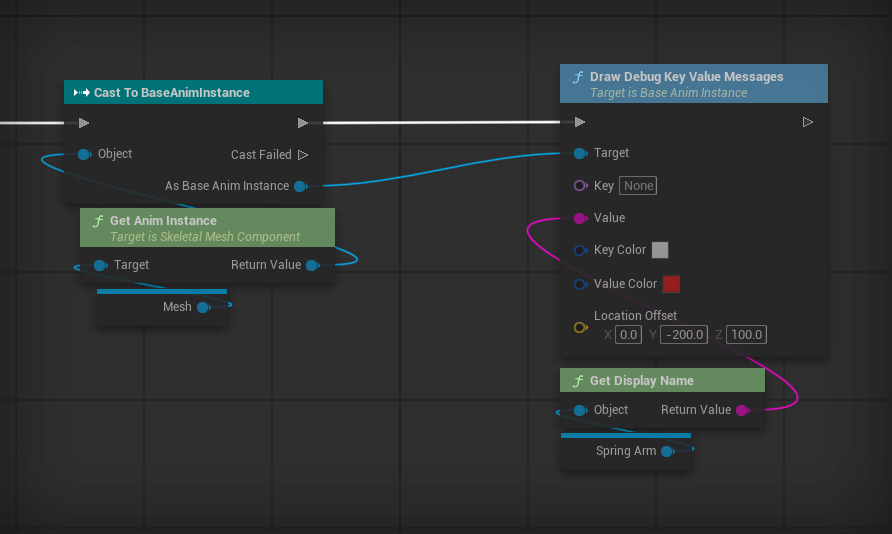
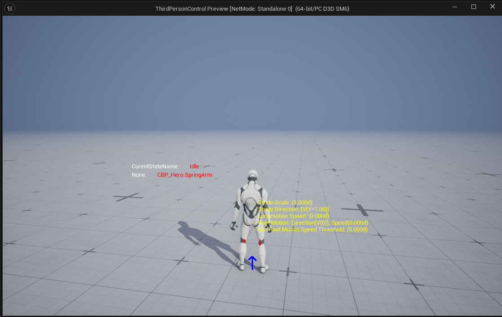

# 动画蓝图参数屏幕调试工具

> 这里用到的动画蓝图基类为自定义的`UBaseAnimInstance`

| 引脚            | 类型         | 默认值 / 用法                            |
| --------------- | ------------ | ---------------------------------------- |
| Key             | FName        | 手动填写参数名称，不要加冒号             |
| Value           | String       | 变量、转换结果、拼接结果或字符串常量均可 |
| Key Color       | Linear Color | 白色，包含自动添加的冒号                 |
| Value Color     | Linear Color | 红色                                     |
| Location Offset | Vector       | (0,-200,100)                             |

## 使用效果

动画蓝图调用：



角色蓝图调用：



效果(人物左侧显示))：



## 迁移到自己的项目

将下面的声明及实现复制到目标 UAnimInstance 派生类中，替换类名和自身头文件名。前置声明放在类外，头文件 region 放在类内，generated.h 保持为最后一个 include。若已有生命周期函数，合并清理调用，不要重复定义。

`BaseAnimInstance.h`

```cpp
class UCanvas;
class APlayerController;
```

```cpp
#pragma region DrawDebugMessages
public:
	virtual void NativeUninitializeAnimation() override;
	virtual void BeginDestroy() override;

	// 手动输入 Key 和 Value；独立颜色、共享位置偏移和自动分行。
	UFUNCTION(BlueprintCallable, Category = "DebugDraw")
	void DrawDebugKeyValueMessages(
		FName Key,
		const FString& Value,
		FLinearColor KeyColor = FLinearColor::White,
		FLinearColor ValueColor = FLinearColor::Red,
		FVector LocationOffset = FVector(0, -200, 100));

private:
	struct FDebugKeyValueMessage
	{
		FString KeyText;
		FString ValueText;
		FLinearColor KeyColor;
		FLinearColor ValueColor;
		FVector WorldLocation;
	};

	TArray<FDebugKeyValueMessage> DebugKeyValueMessages;
	uint64 DebugKeyValueFrame = MAX_uint64;
	FDelegateHandle DebugKeyValueDrawHandle;
	void DrawDebugKeyValueMessages(UCanvas* Canvas, APlayerController* PlayerController);
	void ClearDebugKeyValueMessages();
#pragma endregion DrawDebugMessages
```

`BaseAnimInstance.cpp`

```cpp
#include "BaseAnimInstance.h"
#include "CanvasItem.h"
#include "Debug/DebugDrawService.h"
#include "Engine/Canvas.h"
#include "Engine/Engine.h"
#include "GameFramework/PlayerController.h"
#include "SceneInterface.h"
#include "SceneView.h"
#include "Components/SkeletalMeshComponent.h"
#include "GameFramework/Pawn.h"
```

```cpp
#pragma region DrawDebugMessages

void UBaseAnimInstance::DrawDebugKeyValueMessages(
	const FName Key,
	const FString& Value,
	const FLinearColor KeyColor,
	const FLinearColor ValueColor,
	const FVector LocationOffset)
{
#if ENABLE_ANIM_DRAW_DEBUG
	if (!ensureMsgf(IsInGameThread(), TEXT("Draw Debug Key Value must run on the game thread.")))
	{
		return;
	}
	const USkeletalMeshComponent* Mesh = GetSkelMeshComponent();
	const AActor* Owner = Mesh ? Mesh->GetOwner() : nullptr;
	if (!Owner)
	{
		return;
	}

	FVector DrawLocationOffset = LocationOffset;
	if (const APawn* PawnOwner = TryGetPawnOwner())
	{
		if (const APlayerController* PlayerController =
			Cast<APlayerController>(PawnOwner->GetController()))
		{
			FVector ViewLocation;
			FRotator ViewRotation;
			PlayerController->GetPlayerViewPoint(ViewLocation, ViewRotation);

			// XY 跟随完整相机旋转：X 沿视线前后，Y 沿相机左右。
			// Z 单独叠加，继续保持世界向上。
			DrawLocationOffset = ViewRotation.RotateVector(
				FVector(LocationOffset.X, LocationOffset.Y, 0.0f))
				+ FVector(0.0f, 0.0f, LocationOffset.Z);
		}
	}

	if (DebugKeyValueFrame != GFrameCounter)
	{
		DebugKeyValueMessages.Reset();
		DebugKeyValueFrame = GFrameCounter;
	}
	DebugKeyValueMessages.Add({Key.ToString() + TEXT(":"), Value,
		KeyColor, ValueColor, Owner->GetActorLocation() + DrawLocationOffset});
	if (!DebugKeyValueDrawHandle.IsValid())
	{
		DebugKeyValueDrawHandle = UDebugDrawService::Register(TEXT("Game"),
			FDebugDrawDelegate::CreateUObject(this, &UBaseAnimInstance::DrawDebugKeyValueMessages));
	}
#endif
}

void UBaseAnimInstance::DrawDebugKeyValueMessages(UCanvas* Canvas, APlayerController* PlayerController)
{
#if ENABLE_ANIM_DRAW_DEBUG
	// Debug draw can be called for other editor/PIE worlds. Never leak text into those views.
	if (!Canvas || !Canvas->Canvas || !Canvas->SceneView || !GEngine
		|| !Canvas->SceneView->Family || !Canvas->SceneView->Family->Scene
		|| Canvas->SceneView->Family->Scene->GetWorld() != GetWorld()
		|| DebugKeyValueFrame == MAX_uint64 || GFrameCounter - DebugKeyValueFrame > 1)
	{
		return;
	}
	UFont* Font = GEngine->GetSmallFont();
	if (!Font)
	{
		return;
	}
	// Reset for each viewport draw; stack this instance's messages in submission order.
	float LineOffsetY = 0.0f;
	constexpr float LineSpacing = 4.0f;
	for (const FDebugKeyValueMessage& Message : DebugKeyValueMessages)
	{
		if (Canvas->SceneView->WorldToScreen(Message.WorldLocation).W <= 0.0f)
		{
			continue;
		}
		const FVector ScreenLocation = Canvas->Project(Message.WorldLocation);
		const FVector2D TextPosition(ScreenLocation.X, ScreenLocation.Y + LineOffsetY);
		float KeyWidth = 0.0f;
		float KeyHeight = 0.0f;
		Canvas->StrLen(Font, Message.KeyText, KeyWidth, KeyHeight);
		FCanvasTextItem KeyItem(TextPosition, FText::FromString(Message.KeyText), Font, Message.KeyColor);
		Canvas->DrawItem(KeyItem);
		// Canvas does not reliably expand tabs; use an explicit screen-space gap.
		constexpr float KeyValueGap = 24.0f;
		FCanvasTextItem ValueItem(TextPosition + FVector2D(KeyWidth + KeyValueGap, 0.0f),
			FText::FromString(Message.ValueText), Font, Message.ValueColor);
		Canvas->DrawItem(ValueItem);
		LineOffsetY += KeyHeight + LineSpacing;
	}
#endif
}

void UBaseAnimInstance::ClearDebugKeyValueMessages()
{
	if (DebugKeyValueDrawHandle.IsValid())
	{
		UDebugDrawService::Unregister(DebugKeyValueDrawHandle);
		DebugKeyValueDrawHandle.Reset();
	}
	DebugKeyValueMessages.Reset();
	DebugKeyValueFrame = MAX_uint64;
}

void UBaseAnimInstance::BeginDestroy()
{
	ClearDebugKeyValueMessages();
	Super::BeginDestroy();
}

void UBaseAnimInstance::NativeUninitializeAnimation()
{
	ClearDebugKeyValueMessages();
	Super::NativeUninitializeAnimation();
}

#pragma endregion DrawDebugMessages
```

### 编译与使用

目标运行时模块 Build.cs 确保依赖 Core、CoreUObject、Engine。

关闭编辑器，完整编译 Development Editor，再重启并刷新蓝图节点。动画蓝图父类应为目标动画实例类；不要在线程安全动画更新中调用此函数。

## 多参数自动分行

> **注意：要让多条参数自动排列成同一列，各个节点的 `LocationOffset`（X、Y、Z）必须保持一致。不要为每一行单独修改偏移，行距由工具自动累加；偏移不一致会导致文字错位或重叠。**

同一帧连续调用多个节点，并使用相同的 `LocationOffset`。消息按调用顺序向屏幕下方排列，不需要逐条修改世界 Z。

每绘制一条消息，累计屏幕偏移 `LineOffsetY += KeyHeight + LineSpacing`。`LineSpacing` 默认为 4 个画布像素，修改此常量可以调整额外行距；Key 与 Value 之间仍保持额外 24 像素间距。

行偏移在每次视口绘制开始时重置，不会跨帧累计。镜头后方被跳过的消息不占行。同一个动画实例的消息共享这一行偏移；如果传入不同的 `LocationOffset`，还会在各自锚点上叠加累计行偏移。

这是多条单行消息的自动分行，不是按屏幕宽度自动折行；Key 和 Value 建议均使用单行文本。需要持续显示时，每帧调用这些节点。

## 角色蓝图调用时

通过目标动画实例引用调用：

```text
目标 Skeletal Mesh Component
    → Get Anim Instance
    → Cast To BaseAnimInstance
    → Draw Debug Key Value Messages（Target 接转换结果）
```

检查引用和 Cast 是否有效。文字跟随目标动画实例网格所属 Actor，而非另一个发起调用的 Actor。
